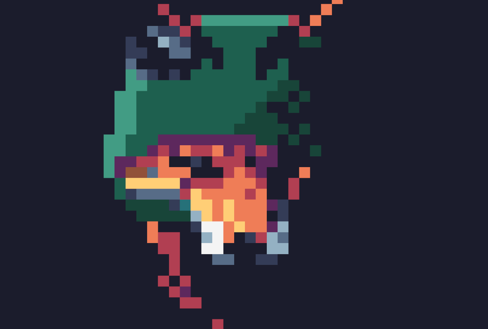

# Dax

**Description**:  
Dax is a game developed in Unity. It's a *Rogue-like* where players navigate procedurally generated dungeons, fight enemies, and search for special items.

## Screenshots
Include some screenshots of the game to give visitors a quick view of how it looks.

## How to Play
Download the portable version of the game [here](https://github.com/Oiress/Dax/releases/tag/game).

Unzip the downloaded file and run `dax.exe` to start playing.

Or

Play it now on [itch.io](https://oires.itch.io/dax)

## Features
- **Genre**: Rogue-like
- **Technologies**: Unity, C#

## Controls
- W, A, S, D: Move
- Spacebar: Jump
- Left click: Attack
- C: Show/Hide HUD
- Esc: Pause Game
- (and some other secret inputs)

